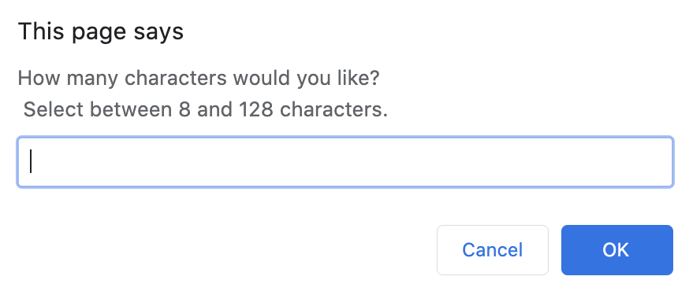
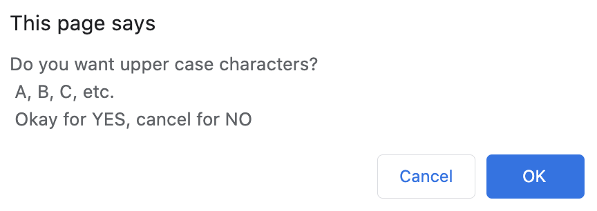
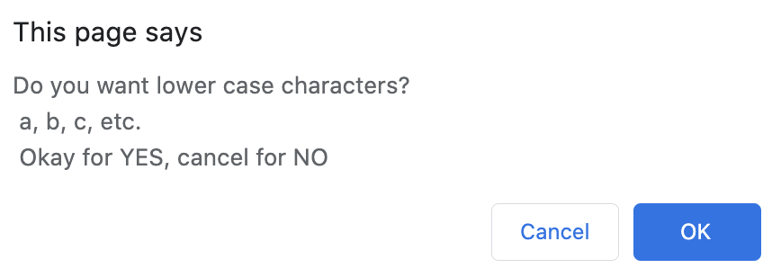
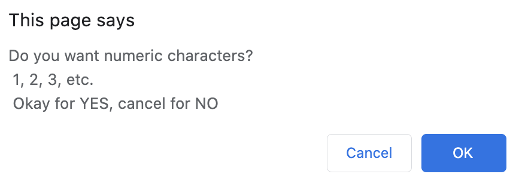
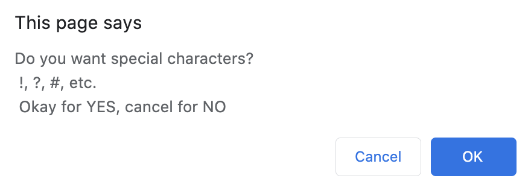
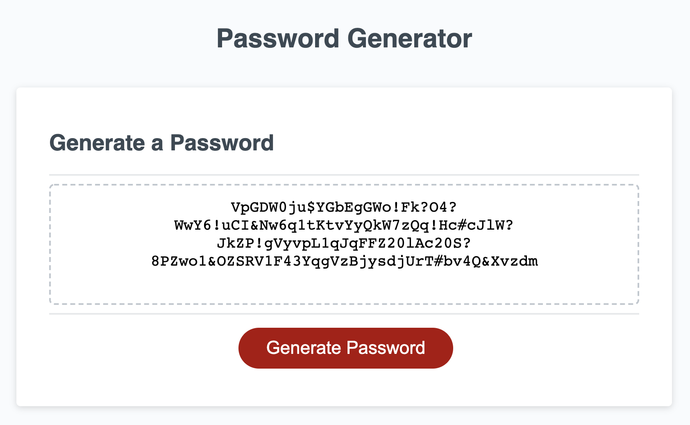

# 3-JavaScript-Password-Generator

## Homework 3 Introduction
Utilizing Javascript, we were tasked with creating a random password generator. Users would input a series of criteria – desired password length, inclusion of various alphanumeric character types, etc. – and the website would output a random password meeting those criteria.

## Deployed Application:
### [https://jpbrickhouse.github.io/3-JavaScript-Password-Generator/](https://jpbrickhouse.github.io/3-JavaScript-Password-Generator/)

## Screenshots
### Prompt - Number of Characters

### Input 1 - Upper Case Characters

### Input 2 - Lower Case Characters

### Input 3 - Numeric Characters

### Input 4 - Special Characters

### Results - Generated Password

## Overall Notes

### HTML
The HTML file for this website was provided by the class, and remains untouched. Some observations are as follows:
- The file is very much a KISS file - "Keep it simple, stupid" - short and efficient
- The textarea has an id of "password"
- The button has an id of "generate"
- These ids were both used in the javascript to allow the user to click the button and to generate the password, based on the user's input criteria
- I originally called the script.js file, but have since opted to utilize my refined script2.js file
- Both still work and meet the assignment requirements, but in very different ways!

### CSS
The CSS file for this website was provided by the class, and remains untouched. Some observations are as follows:
- Responsive layouts changed the size of the button, button font, and the "Your Secure Password" font
- Thoughtful use of classes and ids for styling

### Javascript

#### The initial javascript file, as provided by the class, was sparse
- In the HTML, a button had been created
- Upon clicking the button, the "writePassword" function would run
- Within the "writePassword" function, the following steps would occur:
    - The "generatePassword" function would run, outputting the variable "password"
    - Using a query selector, the HTML document's textarea (which had an id = "password" and placeholder text of "Your Secure Password") would get assigned to the variable "passwordText"
    - Then, the value of the variable "passwordText" would receive the value contained in the variable "password"
    - The value of the variable "passwordText" (aka, the generated password from the function "generatePassword") gets printed back on the HTML document in the textarea

#### Our task was to create the generatePassword function

##### This concerns the ORIGINAL generatePassword function, as contained in javascript "script.js"
- To start, the function initilizes an object ("dataV1") with four arrays, containing the following types of characters:
    - Uppercase letters
    - Lowercase letters
    - Numeric characters (numbers 0 through 9, inclusive)
    - Special characters (e.g. !, ?, #, etc.)
- Then the function initializes a variable "passwordLength" with a value of zero
- A while loop runs...
    - The user is prompted for the number of characters they would like in their password
    - If the user's response is less than 8, greater than 128, or not-a-number, then the loop keeps repeating
- Four consective prompts run, asking the user about the various types of characters they would like to include
- The function initializes an empty array ("initialArray") to store the password; the length of the array is set by the user's response to the earlier prompt about number of characters
- A for loop runs...
    - A series of four random numbers are generated from within specific ranges, corresponding to the lengths of the four arrays within the "dataV1" object
    - Using those four random numbers to correspond to index values, select random characters from within those four arrays from within the "davaV1" object
    - Using if else statements, create an array "characterSelectionArray" that contains a combination of those random characters, based on the user's input preferences from before
    - Generate a random number based on the length of the "characterSelectionArray"
    - Using that random number to correspond to an index value, select a character from "characterSelectionArray" and assign it to the variable "characterSelect"
    - Loop through "initialArray" and assign each index with the random character stored in the variable "characterSelect"
    - Do this loop until the entire "initialArray" has been filled with random characters
- Using the join function to concatenate "initialArray" and generate one long string as "finalArray"
- Store "finalArray" as "password" and return it as the output of the function

##### This concerns the REFINED generatePassword function, as contained in javascript "script2.js"
- Initialize four strings with all the character requirements
- Initialize two variables that are both empty strings
    - "password" will hold the final password
    - "option" will hold the character options availabe to generate the random password
- A while loop runs...
    - The user is prompted for the number of characters they would like in their password
    - If the user's response is less than 8, greater than 128, or not-a-number, then the loop keeps repeating
- Four consective prompts run, asking the user about the various types of characters they would like to include
- Run through five if statements.
    - The first four function as follows: if the user wanted a particular type of character, append those characters to the previously empty options string.
    - The fifth functions as follows: if the user did not enter any type of character, display a message asking the user to try again
- A for loop runs...
    - Generate a random number based on the length of the "options" string
    - Take a random character from within the "options" string
    - Append that random character to the previously empty "password" string
    - Loop until it reachs the limit established by the password length prompted earlier
- Return "password" as the output of the function

## Final Thoughts
- This project was a fun and challenging use of javascript, and allowed me to brush off some old mathematics knowledge along the way.
- Further notes have been commented upon within the code itself.
- I feel like there is potential for further refinement and improvement in my javascript file from lines 60 to 127. It's a thorough approach currently, but I'm curious if there would be a simpler way to cycle through and/or list out the combination arrays? That said, overall, I feel the code is very efficient, and generally lives up to our instructor's humorous motto "DRY - Don't Repeat Yourself!"
- PLOT TWIST: I have found those refinements. Working with my Boot Camp tutor, I was able to signficantly refine my code. Primarily, I was able to bypass the combination array cycle, and simply create an easier way to select from random characters using strings.
